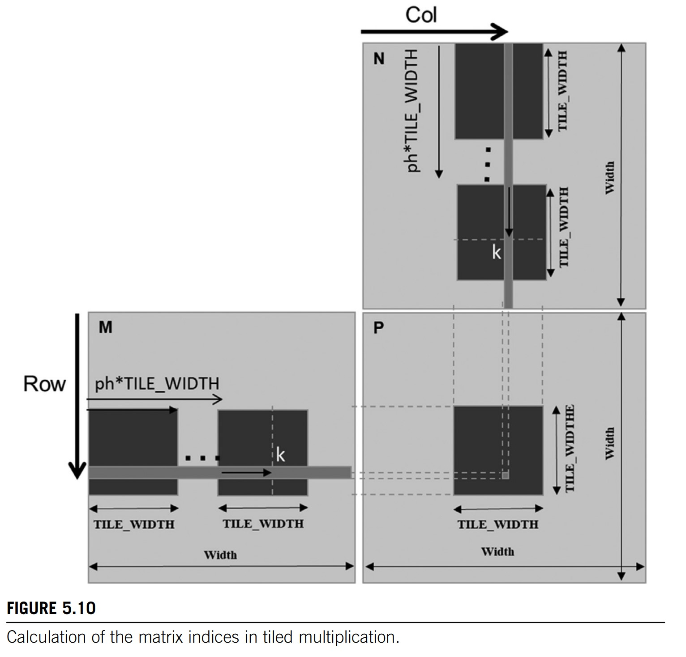

# CUDA-mode 

```bash
docker run --runtime=nvidia --gpus all --shm-size 1g -it -v $PWD:/workspace -w /workspace nvcr.io/nvidia/pytorch:23.08-py3 bash
```

[youtube](https://www.youtube.com/@CUDAMODE)

1. profile cuda kernel in pytorch
2. PMPP book 
3. write cuda kernel in pytorch, and called by pytorch [pytorch load_inline](https://pytorch.org/docs/stable/cpp_extension.html#torch.utils.cpp_extension.load_inline)
4. Memory ( shared memory, HBM and etc )
5. Matrix multiplication with shared memory [notebook](notebook/shared%20matrix%20multiplication.ipynb)


9. [CUDA Redcution](https://github.com/cuda-mode/lectures/tree/main/lecture9)